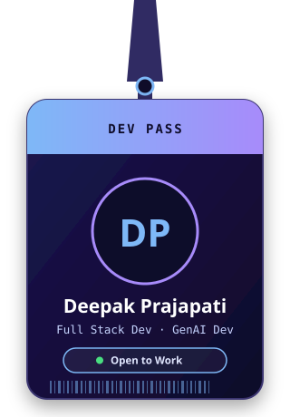
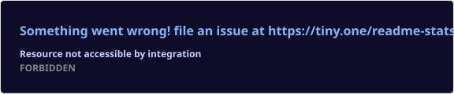

<div align="center">

<picture>
  <source media="(prefers-color-scheme: dark)" srcset="./deepak-banner-dark.svg">
  <source media="(prefers-color-scheme: light)" srcset="./deepak-banner-light.svg">
  
</picture>

<br/>


</div>

<br/>

<table align="center" border="0">
<tr>
<td width="36%" align="center" valign="middle">



</td>
<td width="64%" valign="middle">

### 👨‍💻 About Me

```yaml
name      : Deepak Prajapati
alias     : caged.coder
role      : Full Stack Developer & GenAI Developer
status    : Final Year B.Tech Student · Open to SDE / GenAI Roles
focus     : Scalable Systems · GenAI & Agentic Systems · Microservices · Clean Architecture
learning  : System Design · Advanced Backend Engineering · DSA
open_to   : Full-Time Roles · SDE / GenAI Internships · Open Source Collaborations
motto     : "Good code solves the problem.
             Great code makes the next problem easier to solve."
```

</td>
</tr>
</table>

<br/>

## 🚀 Featured Projects

### 🖥️ DeepakOS — Personal Developer Portfolio
> *My personal, interactive developer portfolio — a dynamic space built to showcase my projects, skills, and journey.*

🔗 *Repo link* https://github.com/deepakprajapati8938-del/Deepak-s-MacOS-Portfolio
🛫 *Live Preview* https://deepak-macos-portfolio.vercel.app/

| | |
|---|---|
| **Tech Stack** | `React` `Tailwind CSS` `Framer Motion` |
| **Highlights** | Fully custom, animated, responsive portfolio experience designed and built end-to-end |

### 🤖 ALOA — Autonomous Laptop Operating Agent
> *An agentic OS-layer assistant that automates system tasks, provides screen intelligence, and orchestrates multi-agent toolchains.*

🔗 *Repo link* https://github.com/deepakprajapati8938-del/ALOA

| | |
|---|---|
| **Tech Stack** | `Next.js` `FastAPI` `Python` `llama.cpp / Gemma` `NetworkX` `Tesseract OCR` |
| **Key Features** | App Manager · System Doctor · Code Healer (self-debugging loop) · Cloud Healer · Auto Deployer · Resume Engine |
| **Highlights** | OODA-loop agent architecture · NetworkX knowledge graph for long-term memory · LLM fallback chain (Groq → Gemini → local Gemma) |

### 🎓 Jules — NEET Prep PWA (RAG Study Companion)
> *A progressive web app for NEET aspirants with an NCERT-grounded RAG chatbot, AI study companion, test generation, and reflective journaling.*

🔗 *Repo link* https://github.com/deepakprajapati8938-del/Jules

| | |
|---|---|
| **Tech Stack** | `React` `TypeScript` `Vite` `FastAPI` `Supabase (pgvector)` `Gemini API` |
| **Key Features** | RAG chatbot grounded on NCERT content · AI-generated practice tests · Reflective journaling with AI feedback · Progress tracking |
| **Highlights** | Full retrieval pipeline — embed query → similarity search → prompt construction → LLM response |

### 🗣️ Sql Whisper — Conversational SQL Assistant
> *Converts natural-language questions into accurate SQL, auto-detects schema, self-corrects failed queries, and returns human-readable answers.*

🔗 *Repo link* https://github.com/deepakprajapati8938-del/Sql-Whisper

| | |
|---|---|
| **Tech Stack** | `FastAPI` `Python` `Streamlit` `Groq / Llama 3` `PostgreSQL` |
| **Key Features** | Automatic schema discovery · NL → SQL generation with context · Sandboxed, read-only query execution · Error-aware self-correction loop |
| **Highlights** | Retry loop that analyzes DB errors and automatically regenerates corrected SQL |

### 🧾 BillBrain AI — Smart Invoice Processor
> *AI-driven billing automation platform that extracts structured data from invoices and simplifies management for businesses.*

🔗 *Repo link* https://github.com/deepakprajapati8938-del/billbrain-ai

| | |
|---|---|
| **Tech Stack** | `Python` `Streamlit` `Gemini` `pytest` `hypothesis` |
| **Key Features** | Batch invoice upload · Per-field confidence scoring · Multi-language parsing · Duplicate detection · Spend analytics dashboard |
| **Highlights** | Property-based testing with Hypothesis for core invariants; enterprise-ready financial automation |

### 🎲 Truth Roulette — Real-time Truth/Dare Party Game
> *A real-time multiplayer party game with a premium casino UI, Hinglish AI-generated content, and resilient reconnect/resume logic.*

🔗 *Repo link* https://github.com/deepakprajapati8938-del/TRUTH-ROULETTE

| | |
|---|---|
| **Tech Stack** | `React` `Vite` `Framer Motion` `Node.js` `Express` `Socket.io` `Groq / Llama 3.1` |
| **Key Features** | Real-time multiplayer rooms · Hinglish AI-generated truths & dares (gender-aware) · 45s reconnect grace window · Mobile-optimized UI |
| **Highlights** | Server-side seat-holding and instant-resume logic built for flaky mobile networks |

### 🎯 Placement Hub — Campus Placement Prep Platform
> *A polished web app for students to track placement prep — personalized dashboards, company tracking, and real-time leaderboards.*

🔗 *Repo link* https://github.com/deepakprajapati8938-del/Placement-Hub

| | |
|---|---|
| **Tech Stack** | `Next.js 15` `React 19` `Tailwind CSS v4` `Framer Motion` `Supabase (Postgres + Auth + Realtime)` |
| **Key Features** | Personalized placement roadmap · Real-time XP leaderboard · Role-based admin suite · Resource repository |
| **Highlights** | Materialized Postgres views powering real-time leaderboard performance |

<br/>

## 📂 More Projects

| Project | Tech | Repo |
|:---|:---:|:---:|
| 🌐 Internship Portal System | `React` `Redux` `Node.js` `Express` `MongoDB` | [Repo](https://github.com/Deepak12159/Internship-Portal) |
| 🐳 FlyRank Backend | `Node.js` `Express` `PostgreSQL` `Redis` `Docker` | [Repo](https://github.com/deepakprajapati8938-del/FlyRank-Backend-API) |
| 🏗️ AI Microservices Platform | `Spring Boot` `RabbitMQ` `Docker` | [Repo](https://github.com/Deepak12159/SpringBoot-AI-Microservices-main)  |
| 📊 GitHub Profile Analyzer | `React` `TypeScript` `D3.js` | [Repo](https://github.com/deepakprajapati8938-del/Github_profile_analyzer)  |
| ✍️ Text-To-Handwriting | `TypeScript` `React` `Tailwind` | [Repo](https://github.com/deepakprajapati8938-del/Text-To-Handwriting)  |
| 📋 Smart Attendance Manager | `React` `JavaScript` `CSS` | [Repo](https://github.com/deepakprajapati8938-del/Smart-Attendance-Manager)  |
| 🧠 AI Plan Generator | `Python` `Flask` `TensorFlow` | [Repo](https://github.com/Deepak12159/AI-PLAN)  |

<br/>

## 🛠️ Tech Stack

<div align="center">

**Languages**


<br/><br/>

**Frameworks & Libraries**


<br/><br/>

**Databases & DevOps**


</div>

---

## 🎯 Current Focus

| Area | Status |
|---|---|
| 🤖 Agentic AI Systems | `Actively Building` |
| 🏗️ Production Full-Stack Apps | `In Progress` |
| 📐 System Design & Architecture | `Active Study` |
| 🧮 Data Structures & Algorithms | `Daily Practice` |
| 🌍 Open Source Contributions | `Ongoing` |

<br/>

<div align="center">

### 📊 GitHub Stats & Graphs




<br/><br/>

<a href="https://git.io/streak-stats"></a>

<br/><br/>


<br/><br/>


<br/><br/>

### 🐍 Watch the snake eat my contributions


<br/><br/>

### 📫 Let's Connect

<a href="https://www.linkedin.com/in/deepak-prajapati-caged-coder/"></a>
<a href="https://github.com/deepakprajapati8938-del"></a>
<a href="https://www.instagram.com/caged.coder/"></a>
<a href="mailto:deepakprajapati8938@gmail.com"></a>

<br/><br/>


<br/><br/>

> *"Good code solves the problem.*
> *Great code makes the next problem* **easier to solve.**"

</div>

<div align="center">


</div>
